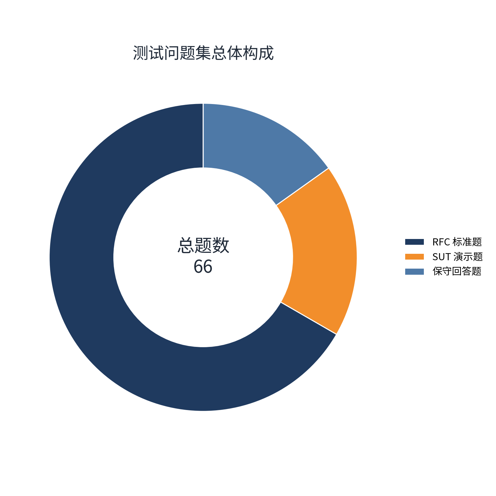
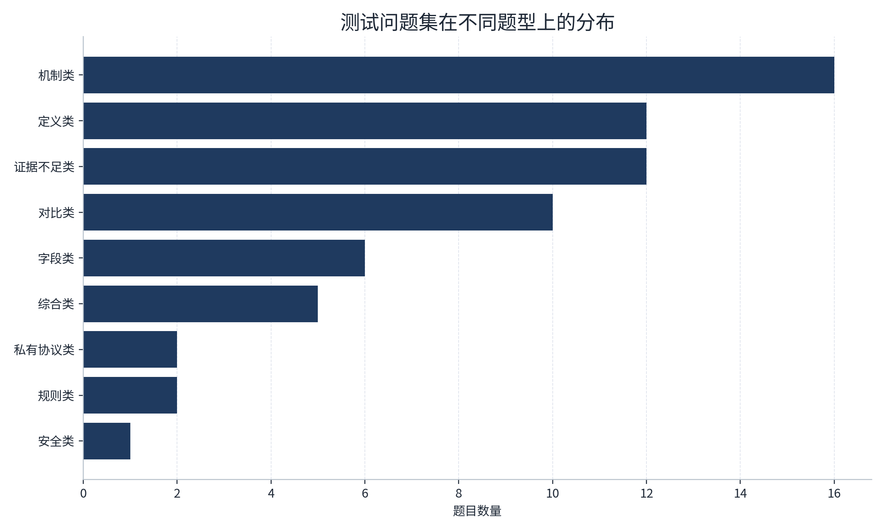
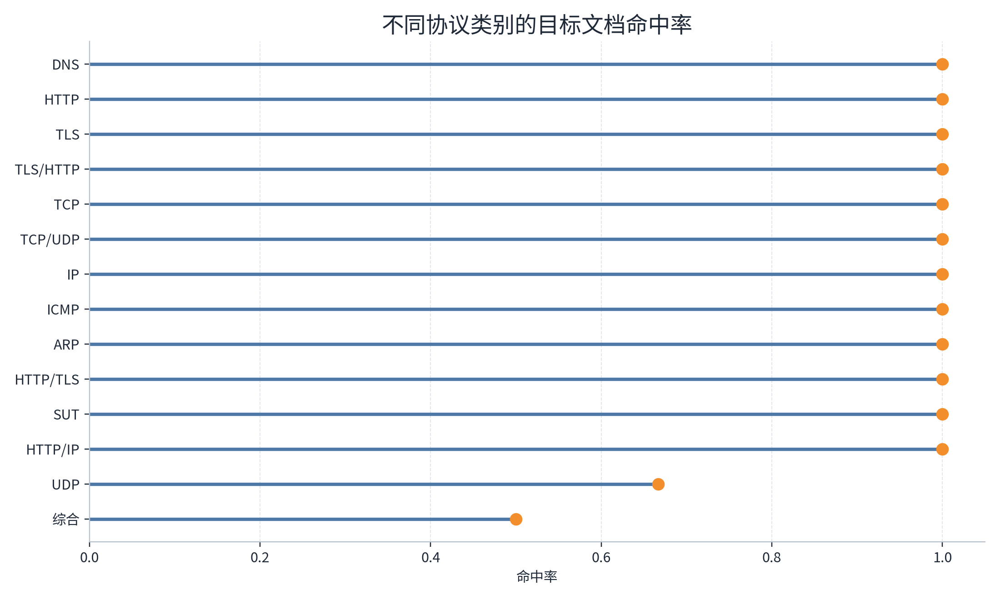
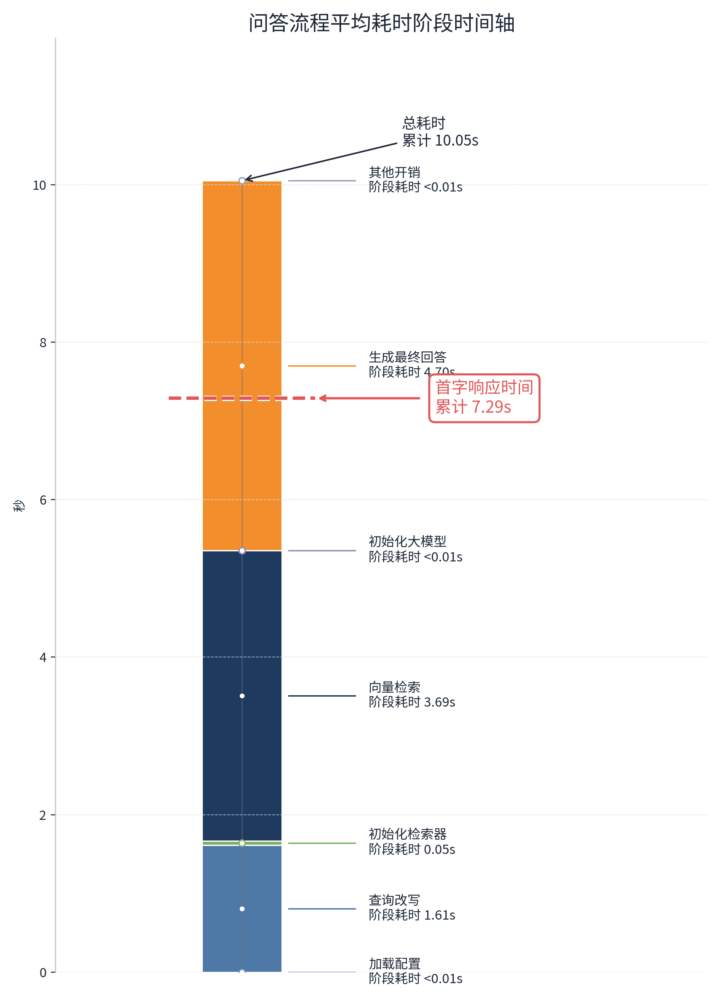
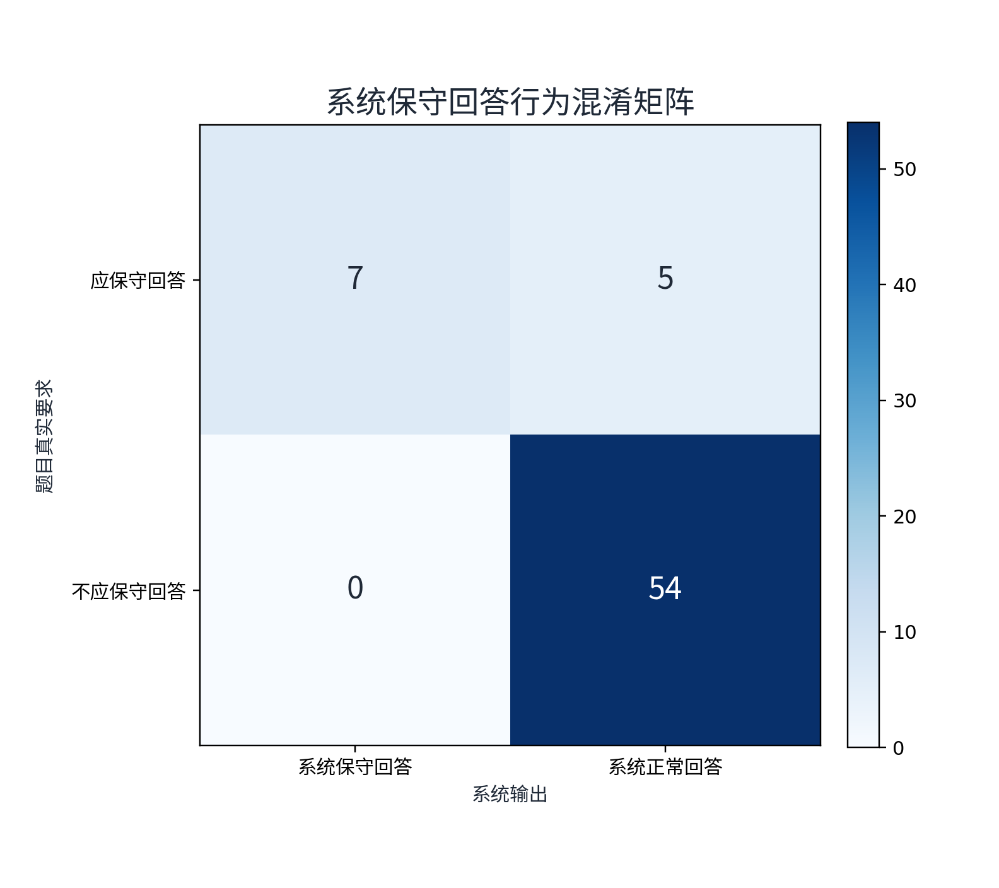
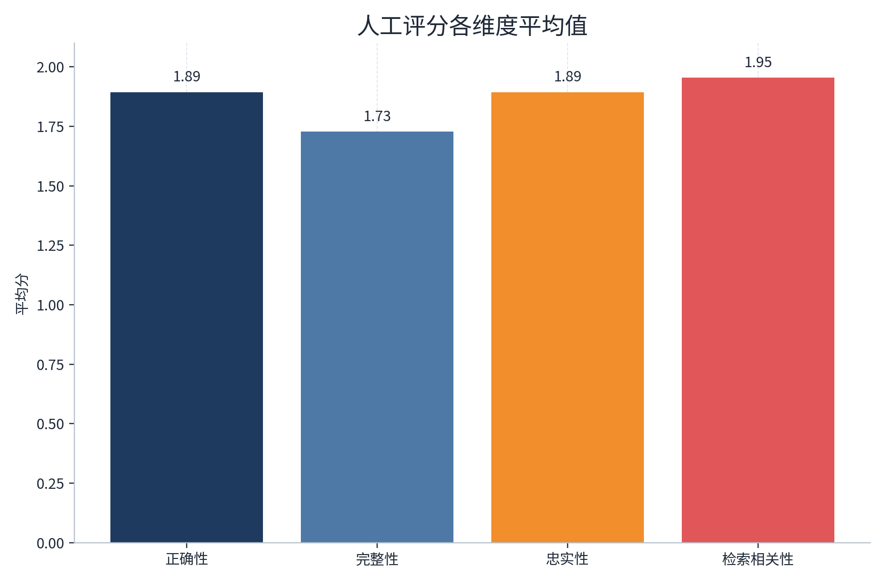
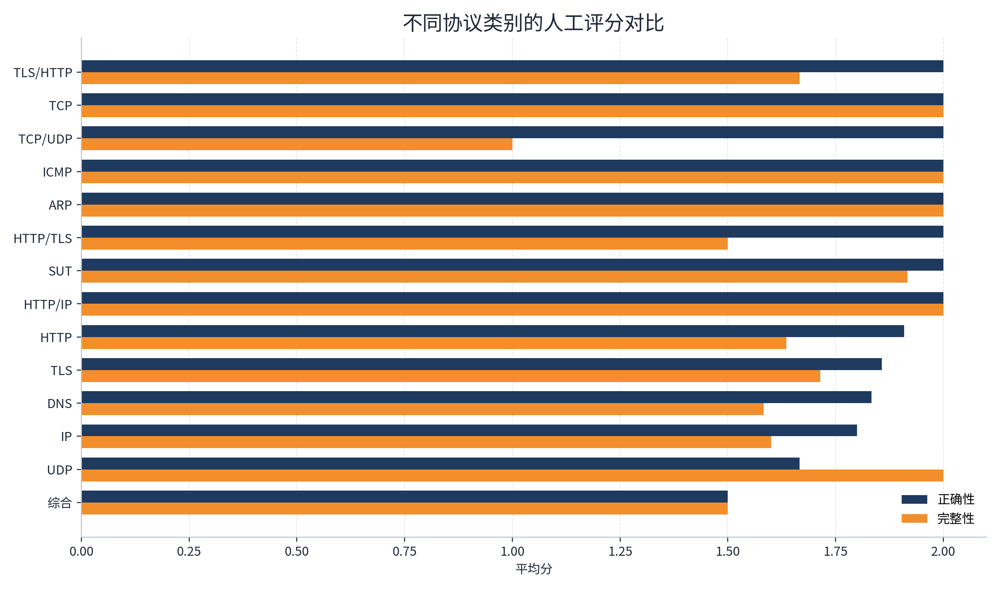
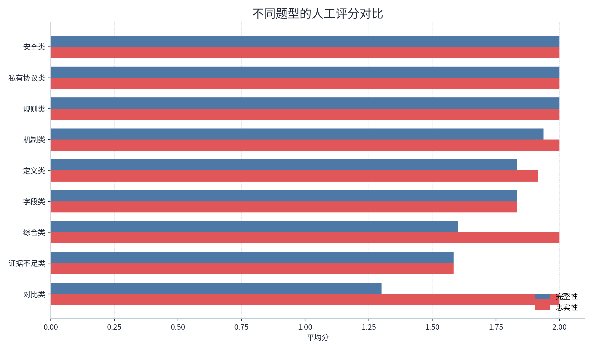

# 系统整体效果评估（主实验）

本节给出系统在当前默认配置下的整体效果评估结果。主实验采用 `with_rewrite` 运行结果作为最终口径，对应评测目录为 `runs/eval/20260430_230707_with_rewrite`。该实验的目的有二：一是评估系统在真实默认配置下的整体问答表现；二是形成论文中“系统主结果”的统一实验基准。与前期用于调试的简化版总结不同，本节基于 **66 道题** 的完整测试集，结合自动评测与人工评分，从检索有效性、响应时延、保守回答能力以及分层表现四个方面进行系统分析。

## 1. 实验目标与评测设置

主实验关注的是“当前可交付系统”的综合表现，而非单一模块的局部改进。因此，本轮评测固定系统默认链路，包括查询改写、向量检索、上下文拼接和基于检索结果的答案生成，直接考察端到端问答质量。

自动评测记录以下指标：

- `target_hit_rate`：是否命中题目预期目标文档，用于衡量检索定位能力。
- `unique_source_count`：回答实际使用的唯一来源数量，用于反映证据覆盖程度。
- `first_token_seconds`：首字响应时间，用于评估用户感知时延。
- `refusal_success_rate`：在应当保守回答的问题上，系统正确拒答或收敛回答边界的比例。

在自动评测之外，又对 66 道题全部进行了人工复核。人工评分采用 0 至 2 分三档制，包含四个维度：

- 正确性（Correctness）：回答结论是否正确。
- 完整性（Completeness）：是否覆盖题目要求的关键点。
- 忠实性（Faithfulness）：结论是否受到检索证据支撑，是否存在越界推断。
- 检索相关性（Retrieval Relevance）：返回上下文与题目的相关程度。

这种“自动指标 + 人工评分”的组合方式，有助于同时回答两个核心问题：系统是否找到了正确材料，以及系统是否基于这些材料给出了高质量答案。

## 2. 测试集构成

本轮主实验共包含 66 道测试题，覆盖 RFC 标准协议知识、私有协议知识以及证据不足场景。其中，RFC 类问题 44 题，占 **66.7%**；SUT 私有协议问题 12 题，占 **18.2%**；专门设置的保守回答测试题 10 题，占 **15.2%**。需要说明的是，除这 10 道拒答专题题外，SUT 分区中还包含 2 道“证据不足类”样本，同样被标注为应当保守回答，因此后续拒答能力统计中的 `should_refuse` 总数为 **12**。从评测设计上看，该测试集不仅覆盖标准协议问答能力，也显式纳入了私有知识接入能力和系统边界控制能力。

从协议分布看，DNS、HTTP 与 SUT 占比最高，分别为 12 题、11 题和 12 题；其余题目覆盖 TLS、TCP、UDP、IP、ICMP、ARP 以及跨协议组合问题。题型方面，机制类 16 题、定义类 12 题、证据不足类 12 题、对比类 10 题，构成了本轮评测的主体。这意味着测试集既包含“单点定义/机制解释”问题，也包含“多要点整合、跨协议比较与证据不足判断”问题，能够较全面地反映系统的真实能力边界。

## 3. 自动评测结果

### 3.1 检索有效性

主实验共 66 题，其中 64 题命中了预期目标文档，目标文档命中率达到 **96.97%**。这一结果说明，在默认配置下，系统已经能够较稳定地把用户问题映射到正确的协议知识源，检索链路整体是可靠的。

同时，系统平均使用 **2.56** 个唯一来源片段生成答案。这说明回答通常不是依赖单一孤立证据，而是建立在多个上下文片段之上。对于 RFC 场景，这种多来源支撑有助于提高解释性与答案稳健性；对于 SUT 私有协议场景，平均唯一来源数为 **1.0**，与该场景主要依赖单一内部规范文档的事实一致，也反向说明检索链路能够稳定聚焦于私有知识源。

按协议细分后，大多数协议组的目标文档命中率均达到 **100%**。仅有两个类别出现明显下降：UDP 类命中率为 **66.67%**，综合类命中率为 **50.00%**。这表明系统在单一协议、边界明确的问题上检索表现成熟，但在跨协议整合、覆盖范围较宽的问题上，检索与查询改写仍存在一定波动。

从论文表达上，这一结果支持如下判断：**系统的主要瓶颈已不在“找不到相关文档”，而更多转向“找到正确文档后，如何更完整、更克制地组织答案”。**

### 3.2 时延表现

主实验平均总耗时为 **10.05 s**，其中平均首字响应时间为 **7.29 s**。考虑到首字时间更贴近用户主观体验，因此本文以 `first_token_seconds` 作为系统响应效率的主要指标。整体来看，系统已经能够在 8 秒以内完成大多数问题的首字输出，但对于少数复杂问题，首字时延仍然较高。

将总耗时拆解后可见：

- 查询改写平均耗时 **1.61 s**，占总耗时 **16.0%**。
- 检索阶段平均耗时 **3.69 s**，占总耗时 **36.7%**。
- 答案生成平均耗时 **4.70 s**，占总耗时 **46.7%**。

这说明当前默认系统的时延主要由“检索 + 生成”两部分构成，其中生成阶段占比最高，检索阶段次之；查询改写虽然带来了额外开销，但占比相对可控。换言之，`with_rewrite` 配置增加的改写步骤并没有主导整体时延，系统的性能瓶颈仍主要位于上下文检索与答案生成。

进一步观察逐题时延，首字最慢的问题主要集中在两类场景：

- 多文档整合或跨版本比较问题，如“HTTP/3 和 HTTP/2 的主要区别是什么”。
- 需要结合私有协议规则进行解释的问题，如 “SUT 中什么情况下可能返回 475 Quiet_Hours_Restricted？”。

这说明系统时延并不只是由协议类别决定，更明显受到“是否需要跨段证据整合、是否需要长答案组织”的影响。

### 3.3 保守回答能力

主实验中共有 **12** 道题被标注为“应当保守回答”，其中包括 10 道拒答专题题和 2 道位于 SUT 分区的证据不足题。系统成功触发保守回答 **7** 次，拒答成功率为 **58.33%**。混淆情况进一步显示：

- 真正例（应拒且拒了）7 题
- 假负例（应拒但未拒）5 题
- 假正例（不应拒却误拒）0 题
- 真负例（正常回答且未误拒）54 题

这组结果具有两个重要含义。第一，系统具有一定的边界意识，并且没有出现“过度保守导致大量误拒”的问题，说明当前提示策略是偏稳健的。第二，保守回答能力仍不充分，特别是在涉及“是否一定更快”“是否一定更安全”“是否能够解决所有问题”等绝对化判断时，系统仍会倾向于给出分析性回答，而不是明确收敛到“证据不足，无法下定论”的立场。

从主实验定位来看，这一结果说明系统已经初步具备“知识问答系统应有的风险控制能力”，但这一能力尚未达到论文中可以宣称“稳定可靠拒答”的程度，因此在论文表述上更适合写为：**系统具备初步保守回答能力，但在证据不足场景下仍有继续优化空间。**

## 4. 人工评分结果

### 4.1 总体质量

人工评分结果表明，系统在正确性、忠实性和检索相关性上已经达到较高水平，而主要短板集中在完整性维度。四项平均分如下：

| 评分维度 | 平均分 | 折算百分制 |
| --- | ---: | ---: |
| 正确性 | 1.894 / 2 | 94.70% |
| 完整性 | 1.727 / 2 | 86.36% |
| 忠实性 | 1.894 / 2 | 94.70% |
| 检索相关性 | 1.955 / 2 | 97.73% |

这一结果与自动评测的结论高度一致。检索相关性接近满分，说明系统返回的上下文整体“找得准”；正确性和忠实性同样较高，说明系统多数情况下能够围绕证据作答，而非无根据发散；相较之下，完整性明显偏低，意味着系统更常见的问题不是“答错”，而是“答得不够全”。这也是 RAG 系统在论文实验中非常有价值的一个发现：当检索质量已经较高时，系统性能上限会更多受答案组织策略影响。

### 4.2 按协议类别分析

不同协议组之间的表现存在一定差异，但总体趋势较为清晰：

- TCP、ICMP、ARP、HTTP/IP 等小样本协议组四项指标均接近或达到满分，说明系统在边界明确、知识结构相对集中的问题上表现稳定。
- SUT 私有协议组平均正确性 **2.0**、完整性 **1.917**、忠实性 **2.0**、检索相关性 **2.0**，说明系统不仅能够接入私有知识源，而且在私有协议问答上具备较高稳定性。
- DNS 组平均完整性仅 **1.583**，HTTP 组平均完整性 **1.636**，是主实验中较明显的薄弱环节。这表明在文档规模较大、术语密集、版本与机制细节复杂的协议类别上，系统虽能命中文档，但答案覆盖仍容易不充分。
- UDP 组的检索相关性仅 **1.333**，且目标文档命中率为 **66.67%**，说明该组问题在“检索到最优证据”这一步就已出现波动，进而影响到最终回答质量。
- 综合组四项指标均为 **1.5** 左右，同时命中率仅 **50.00%**，表明跨协议综合题仍然是默认系统配置下最具挑战的一类问题。

从论文表述角度，这一层分析可支撑一个更细的结论：**系统已在单协议和私有协议场景中形成较稳定的可用能力，但在多协议耦合、知识跨度较大的问题上，仍有明显的完整性与稳定性损失。**

### 4.3 按题型分析

题型分析比协议分析更能揭示系统能力边界。主实验中最值得关注的并不是“哪一种协议最难”，而是“哪一种认知任务最难”。结果显示：

- 机制类问题表现最好，平均正确性 **2.0**、完整性 **1.938**、忠实性 **2.0**、检索相关性 **2.0**。这说明系统对“工作流程、交互机制、设计目的”类问题的处理已经较成熟。
- 定义类问题同样表现较好，平均正确性 **1.917**、完整性 **1.833**，说明系统能够较好地完成术语解释与概念界定。
- 对比类问题的正确性达到 **2.0**，但完整性仅 **1.300**，是所有主要题型中完整性最低的一类。这说明系统通常能把握比较方向，但容易遗漏其中一侧的差异点、适用条件或设计取舍。
- 综合类问题正确性仍为 **2.0**，但完整性仅 **1.600**。这与对比类问题类似，说明当问题要求同时组织多个知识点时，系统更容易出现“核心结论正确，但论述展开不足”的现象。
- 证据不足类问题平均正确性、完整性和忠实性均为 **1.583**。折算后约为 **79.17%**，显著低于其他题型。这一结果说明保守回答能力目前仍是主实验中最明确的短板，其本质并不在检索不到证据，而在于系统尚未稳定地把“证据边界”转化为“回答边界”。

这一组结果非常适合写入论文讨论部分，因为它揭示了系统优化方向并非单纯提升召回率，而是需要在以下两个方面继续加强：

- 提升多要点组织能力，尤其是对比类与综合类问题的结构化回答能力。
- 提升证据不足识别与保守回答稳定性，减少“应拒未拒”的情况。

## 5. 结果讨论

综合自动评测与人工评分，可以对当前默认系统形成较明确的总体判断。

首先，系统已经具备较强的端到端可用性。目标文档命中率达到 **96.97%**，检索相关性达到 **97.73%**，说明系统已经能够较稳定地把问题对齐到正确知识源，并返回高度相关的上下文。与此同时，正确性与忠实性均达到 **94.70%**，说明系统在大多数情况下不是“凭空生成”，而是能够围绕证据给出可靠回答。

其次，当前系统的主要问题已从“检索不到”转向“组织不全”和“边界不稳”。完整性只有 **86.36%**，在对比类与综合类问题上下降更明显；保守回答成功率仅 **58.33%**，说明系统对证据边界的执行仍不稳定。这表明，对于当前阶段的 RAG 系统而言，后续优化重点应更多落在答案组织策略、拒答判定策略以及复杂问题分解能力，而不是简单地继续扩大知识库规模。

最后，主实验也验证了系统在私有知识接入场景中的可行性。SUT 相关问题不仅命中率达到 **100%**，人工评分也整体较高，说明该架构并不局限于 RFC 标准文档，而可以平滑迁移到企业内部规范、专有协议文档等场景。这一点对于论文中的系统实用价值论证尤为重要。

## 6. 小结

主实验表明，基于 `with_rewrite` 默认配置的系统已经具备较好的整体协议问答能力。其核心优势在于：

- 检索链路稳定，目标文档命中率高；
- 回答整体正确且忠实于证据；
- 对标准 RFC 与私有协议知识均具备较好适配性。

与此同时，系统仍存在两个清晰短板：

- 对比类、综合类问题的完整性不足；
- 证据不足场景下的保守回答能力仍不稳定。

因此，论文中可以将本节实验结果概括为：**当前系统已经实现“高命中、高相关、高正确”的基础目标，并具备私有知识扩展能力；其后续优化重点不再主要是检索可用性，而是复杂问题下的答案完整性与保守回答稳定性。**
