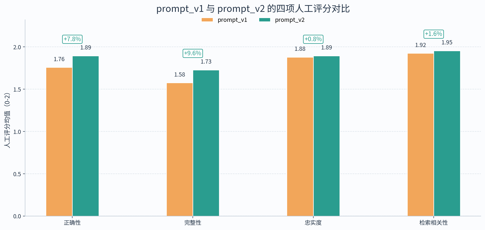
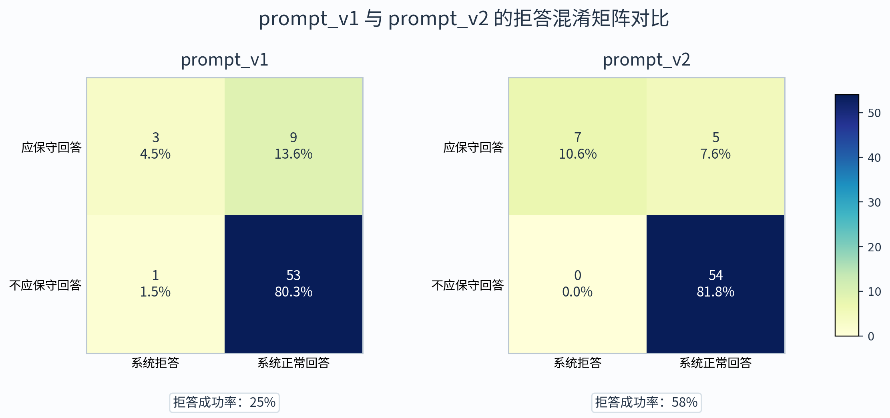
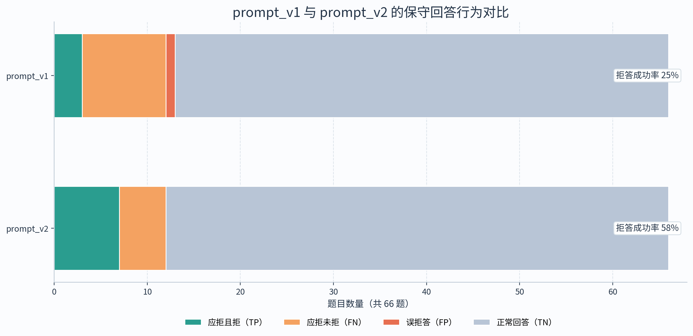
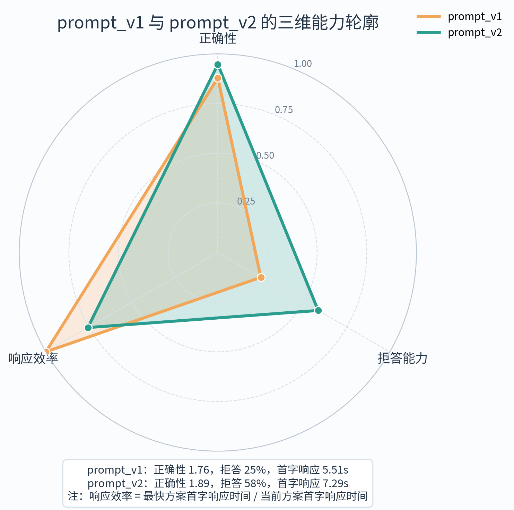
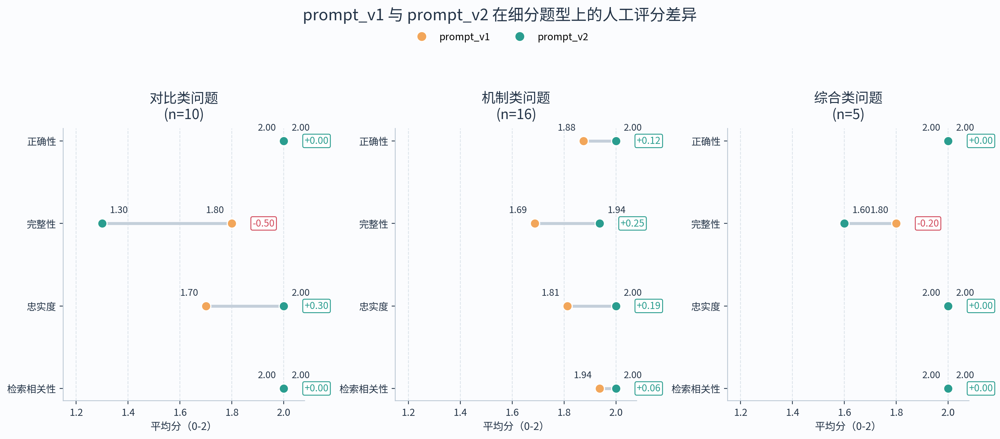

# 提示词优化实验结果分析

## 1. 实验目的

本实验旨在验证回答提示词从 `prompt_v1` 优化到 `prompt_v2` 后，系统在回答质量、保守回答能力以及交互效率上的变化。实验采用固定知识库、固定检索配置、固定模型与固定题集，仅替换回答提示词模板，因此两组结果差异可主要归因于提示词本身的调整。

本节统一使用如下实验组名称：

- `prompt_v1`
- `prompt_v2`

其中，评测均基于主测试集 66 题完成，人工评分维度包括：

- 正确性（Correctness）
- 完整性（Completeness）
- 忠实度（Faithfulness）
- 检索相关性（Retrieval Relevance）

每项人工评分均采用 `0~2` 分区间。

---

## 2. 实验设置

### 2.1 评测对象

| 实验组 | 运行目录 | 题目数 |
|---|---|---:|
| `prompt_v1` | `20260507_094531_prompt_v1` | 66 |
| `prompt_v2` | `20260430_230707_with_rewrite` | 66 |

### 2.2 对比原则

本实验为单变量对比实验。除回答提示词版本不同外，其余因素保持一致，包括：

- 知识库与索引内容
- 检索流程与参数
- 模型配置
- 测试题集
- 人工评分标准

因此，本实验能够较为直接地评估提示词优化本身对系统表现的影响。

---

## 3. 总体结果

### 3.1 核心指标对比

| 指标 | `prompt_v1` | `prompt_v2` | 绝对变化 | 相对变化 |
|---|---:|---:|---:|---:|
| 正确性 | 1.758 | 1.894 | +0.136 | +7.8% |
| 完整性 | 1.576 | 1.727 | +0.152 | +9.6% |
| 忠实度 | 1.879 | 1.894 | +0.015 | +0.8% |
| 检索相关性 | 1.924 | 1.955 | +0.030 | +1.6% |
| 目标文档命中率 | 95.45% | 96.97% | +1.52 个百分点 | +1.6% |
| 拒答成功率 | 25.00% | 58.33% | +33.33 个百分点 | +133.3% |
| 平均首字响应时间 | 5.51s | 7.29s | +1.78s | +32.3% |
| 平均总耗时 | 7.18s | 10.05s | +2.87s | +40.0% |

从整体结果看，`prompt_v2` 在四项人工评分指标上均优于 `prompt_v1`。其中，正确性提升 `7.8%`，完整性提升 `9.6%`，说明优化后的提示词不仅提升了回答结论的可靠性，也提升了要点覆盖程度。忠实度和检索相关性虽然提升幅度相对较小，但仍保持稳定上升，表明 `prompt_v2` 并非通过“更自由发挥”获得更高分，而是在维持基于证据回答的前提下改善了整体表现。

同时，`prompt_v2` 的目标文档命中率也略高于 `prompt_v1`，从 `95.45%` 提升到 `96.97%`。尽管回答提示词本身并不直接参与检索，但这一结果至少说明，在当前实验条件下，提示词优化并未带来检索效果退化。与之相对，`prompt_v2` 的主要代价在于响应速度下降，平均首字响应时间增加 `1.78s`，相对增幅约 `32.3%`。这意味着 `prompt_v2` 的收益更主要体现在回答质量和边界控制，而不是交互速度。

图 1  `prompt_v1` 与 `prompt_v2` 的四项人工评分对比

图 1 进一步直观展示了两版提示词在四项核心质量指标上的差异。可以看到，`prompt_v2` 在每一项指标上均高于 `prompt_v1`，其中完整性和正确性的提升最为明显。这说明本轮提示词优化不仅加强了保守回答控制，也对正常问答场景下的内容质量产生了正向影响。

---

## 4. 保守回答能力分析

### 4.1 拒答行为混淆矩阵

| 实验组 | TP | FP | FN | TN | 拒答成功率 |
|---|---:|---:|---:|---:|---:|
| `prompt_v1` | 3 | 1 | 9 | 53 | 25.00% |
| `prompt_v2` | 7 | 0 | 5 | 54 | 58.33% |

与 `prompt_v1` 相比，`prompt_v2` 在应拒答问题上的正确触发数从 `3` 题提升至 `7` 题，净增加 `4` 题；同时，应拒未拒（FN）从 `9` 题下降至 `5` 题，减少 `44.4%`。更重要的是，`prompt_v2` 没有引入更多误拒答，反而将误拒答（FP）从 `1` 题降为 `0`。因此，`prompt_v2` 的优势并非来自“更保守所以更容易拒绝一切”，而是来自更准确的边界控制。

从比率角度看，`prompt_v2` 的拒答成功率较 `prompt_v1` 提升了 `33.33` 个百分点；若按相对增幅计算，则提升幅度达到 `133.3%`。这一结果说明，提示词中关于“证据不足时明确收敛”“不要扩展推断”“不要把未在上下文中明确出现的信息表达为确定事实”的约束，确实有效提高了系统在证据不足场景下的稳健性。

图 2  `prompt_v1` 与 `prompt_v2` 的拒答混淆矩阵对比

图 2 采用更标准的分类矩阵形式展示拒答行为。可以看到，`prompt_v2` 在左上角“应保守回答且系统拒答”的格子明显大于 `prompt_v1`，同时右上角“应保守回答但系统仍继续作答”的格子明显缩小。这说明优化后的提示词更有能力在应拒场景中及时收敛回答边界。

图 3  `prompt_v1` 与 `prompt_v2` 的拒答行为结构对比

图 3 用堆叠条形图展示了同一组数据的结构比例。与图 2 相比，该图更适合展示整体构成变化：`prompt_v2` 的 TP 部分明显增厚，FN 部分明显缩短，而 FP 并未扩大。两图结合使用，可以从“标准分类结果”和“结构占比变化”两个角度共同支持 `prompt_v2` 在保守回答能力上的优势。

---

## 5. 质量与效率的综合权衡

`prompt_v2` 的收益主要体现为两方面：一是人工正确性从 `1.758` 提升到 `1.894`，二是拒答成功率从 `25.00%` 提升到 `58.33%`。也就是说，`prompt_v2` 同时改善了“该答时答得更稳”与“该收时更能收住”这两个关键维度。相较之下，`prompt_v1` 的唯一明显优势是首字响应更快。

若从交互体验角度考察，`prompt_v1` 的平均首字响应时间为 `5.51s`，`prompt_v2` 为 `7.29s`。两者相差约 `1.78s`，说明 `prompt_v2` 在生成前期的组织与约束成本更高。然而，在以 RFC 问答可靠性为核心目标的论文实验中，这种时延代价是可以接受的，因为它换来了更高的回答准确性和显著更好的边界控制能力。

图 4  `prompt_v1` 与 `prompt_v2` 的三维能力轮廓

图 4 以标准化方式将正确性、拒答能力与响应效率三个维度汇总到同一图中。可以看到，`prompt_v2` 在正确性和拒答能力两个关键维度上均明显优于 `prompt_v1`，而 `prompt_v1` 只在响应效率上占优。这说明本轮提示词优化体现的是一种“以适度的交互时延换取更高质量与更稳边界”的取舍方向。

---

## 6. 细分题型分析

为进一步观察提示词优化对不同题型的影响，本研究选取了最具代表性的三类问题进行细分分析：对比类、机制类与综合类。它们分别对应“差异点组织能力”“流程机制解释能力”和“多要点整合能力”。

### 6.1 细分题型对比结果

| 题型 | 指标 | `prompt_v1` | `prompt_v2` | 绝对变化 | 相对变化 |
|---|---|---:|---:|---:|---:|
| 对比类 | 正确性 | 2.000 | 2.000 | +0.000 | 0.0% |
| 对比类 | 完整性 | 1.800 | 1.300 | -0.500 | -27.8% |
| 对比类 | 忠实度 | 1.700 | 2.000 | +0.300 | +17.6% |
| 机制类 | 正确性 | 1.875 | 2.000 | +0.125 | +6.7% |
| 机制类 | 完整性 | 1.688 | 1.938 | +0.250 | +14.8% |
| 机制类 | 忠实度 | 1.812 | 2.000 | +0.188 | +10.3% |
| 综合类 | 正确性 | 2.000 | 2.000 | +0.000 | 0.0% |
| 综合类 | 完整性 | 1.800 | 1.600 | -0.200 | -11.1% |
| 综合类 | 忠实度 | 2.000 | 2.000 | +0.000 | 0.0% |

从细分结果看，`prompt_v2` 的收益并不是在所有题型上均匀分布的，而是表现出明显的题型差异。

首先，在**机制类问题**上，`prompt_v2` 的表现最为突出。其正确性提升 `6.7%`，完整性提升 `14.8%`，忠实度提升 `10.3%`。这说明新提示词对“按步骤、阶段或关键环节组织回答”的引导是有效的，模型在解释协议机制时能够更完整、更稳定地围绕文档证据展开。

其次，在**对比类问题**上，`prompt_v2` 呈现出一种“更忠实但更克制”的特征。两版提示词在正确性上均为满分，但 `prompt_v2` 的忠实度从 `1.700` 提升到 `2.000`，而完整性从 `1.800` 降至 `1.300`。这意味着 `prompt_v2` 更倾向于只输出上下文中能够被明确支持的差异点，从而减少了外推性组织与补充，也因此牺牲了一部分“看起来更全”的展开程度。

再次，在**综合类问题**上，`prompt_v2` 与 `prompt_v1` 的正确性和忠实度基本一致，但完整性略有下降。这表明在需要整合多个来源或多个维度的问题上，`prompt_v2` 的保守表达风格可能在一定程度上抑制了内容铺开。不过，从整体实验结果来看，这种局部下降并没有抵消它在机制类问题和拒答能力上的总体收益。

图 5  `prompt_v1` 与 `prompt_v2` 在细分题型上的人工评分差异

图 5 更直观地展示了三类问题中的具体变化方向。可以看到，`prompt_v2` 在机制类问题上几乎形成全面提升，而在对比类和综合类问题上则主要体现为忠实度提升与完整性收缩并存。这一结果为后续进一步优化提示词提供了方向：若希望下一版提示词继续改进，可考虑专门增强对比类和综合类问题中的“差异点覆盖”与“多维整合”能力，同时保持当前版本在忠实性与保守回答上的优势。

---

## 7. 结果讨论

综合上述结果，可以将本轮提示词优化的效果概括为以下三点：

第一，`prompt_v2` 在总体质量上优于 `prompt_v1`。人工评分四项指标全面领先，说明提示词优化确实提升了系统的回答质量，而不仅仅是改变了表面上的措辞风格。

第二，`prompt_v2` 在边界控制上的收益尤为显著。拒答成功率提升 `33.33` 个百分点，是本轮实验中最明确、最具有方法论价值的改进。这说明提示词中的保守性约束能够有效减少证据不足场景下的过度生成。

第三，`prompt_v2` 的代价主要体现在速度上。平均首字响应时间增加 `32.3%`，平均总耗时增加 `40.0%`。因此，`prompt_v2` 更适合以回答可靠性为优先目标的系统配置；若未来希望进一步提升用户体验，则需要在不削弱当前边界控制能力的前提下，对提示词长度、回答结构和生成策略做进一步优化。

---

## 8. 结论

在保持索引、检索配置和模型参数不变的前提下，仅对回答提示词进行优化，系统便在多项关键指标上获得了稳定提升。与 `prompt_v1` 相比，`prompt_v2` 在正确性、完整性、忠实度、检索相关性和拒答成功率上均表现更优，其中拒答成功率提升最为显著，达 `33.33` 个百分点。虽然 `prompt_v2` 在交互时延上有所增加，但其在回答可靠性与证据不足场景稳健性上的收益更符合本项目面向 RFC 问答系统的设计目标。

因此，本研究认为：`prompt_v2` 是较 `prompt_v1` 更成熟、更适合作为系统默认提示词的版本。后续工作可在保留当前忠实性与拒答优势的基础上，进一步针对对比类与综合类问题优化其完整性表现，从而获得更均衡的整体效果。
