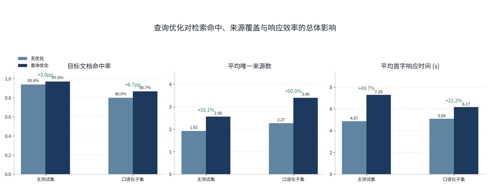
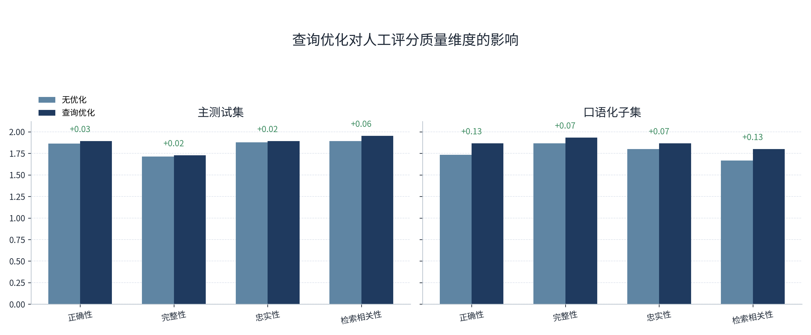
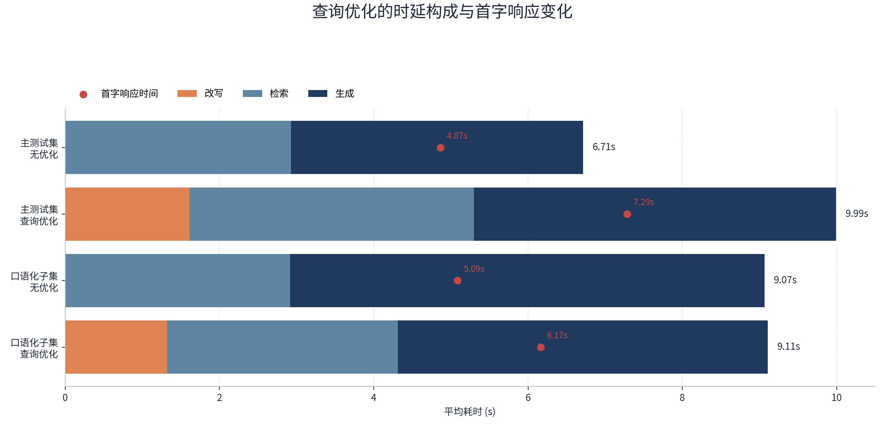
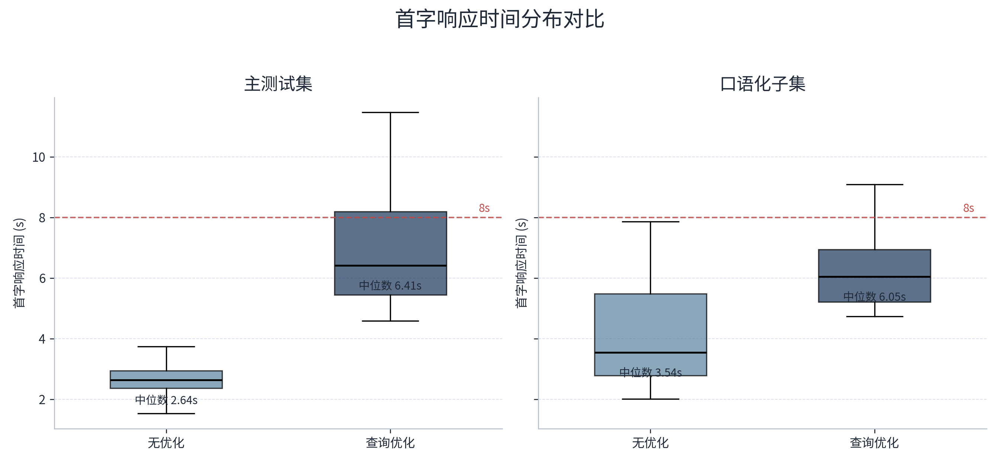
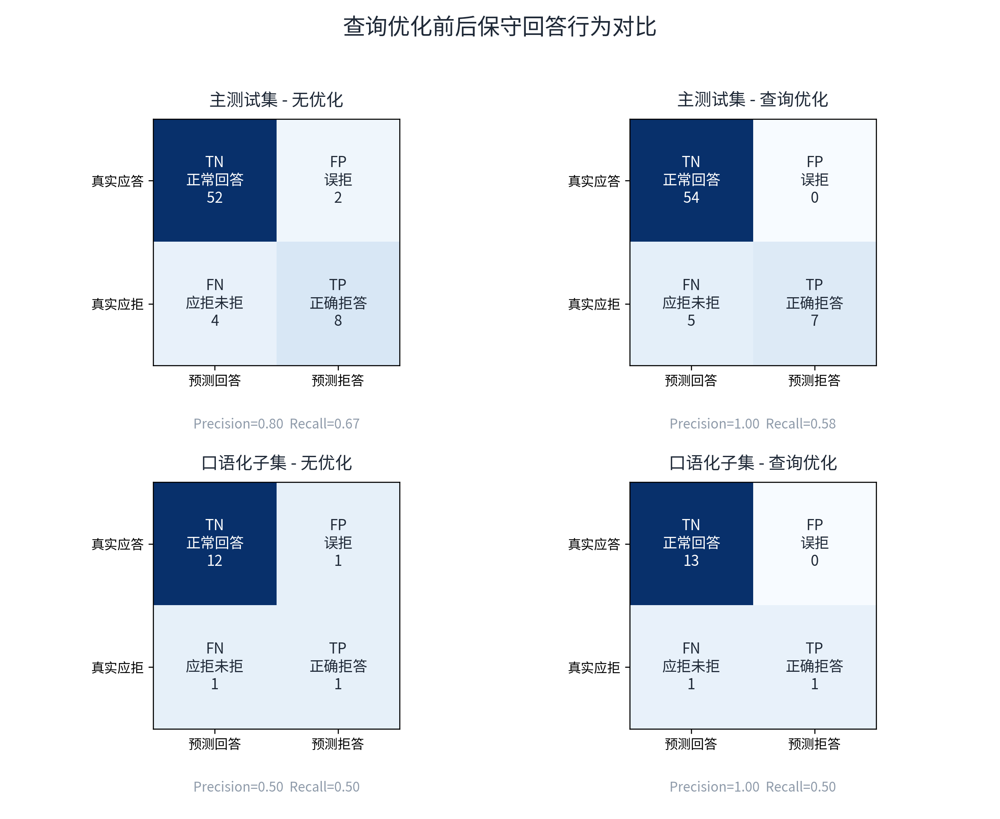
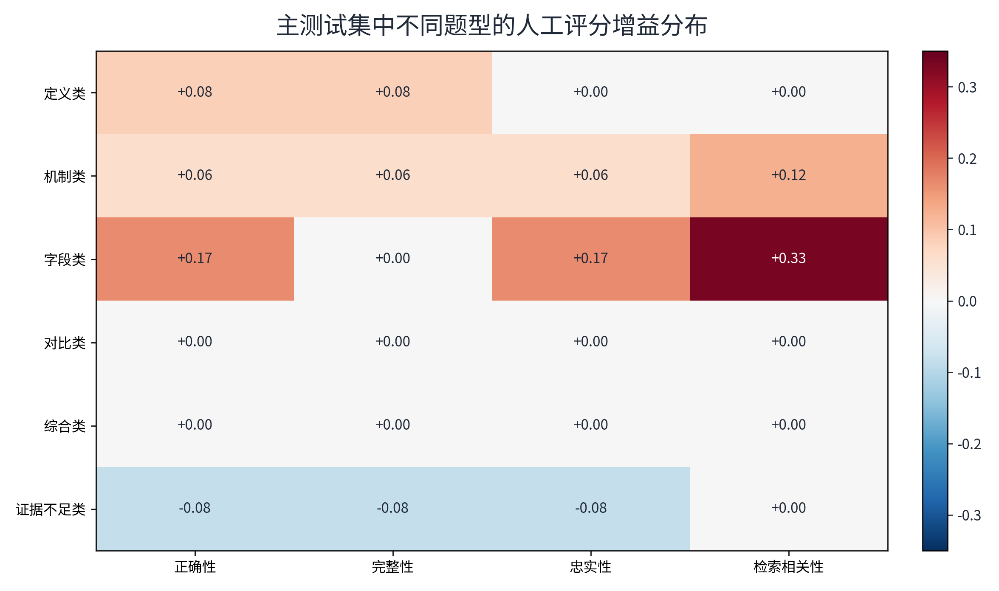
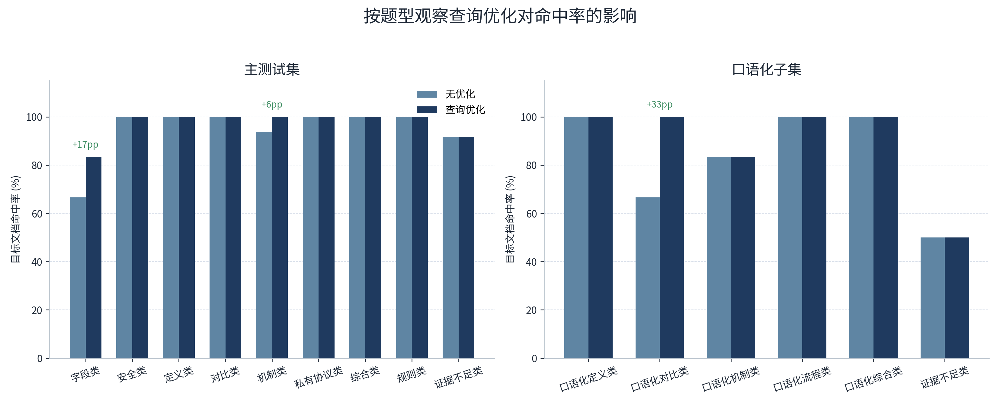

# 查询优化效果评估实验

本节系统评估查询优化链路对协议问答系统整体性能的影响。这里的“查询优化”并非仅指单一的查询改写，而是由 **查询改写（query rewrite）+ 分别检索（multi-query retrieval）+ 来源去重（source deduplication）** 组成的一体化增强链路。该实验旨在回答以下三个核心问题：

1. 查询优化是否能够提高目标协议文档的定位能力，并改善检索证据覆盖范围？
2. 查询优化带来的检索收益，是否能够进一步转化为回答质量的提升？
3. 这一路径增强所获得的质量收益，是否伴随着可量化的响应时延代价，以及这种代价在不同问题场景下是否值得接受？

从系统设计角度看，这一实验非常关键。因为如果查询优化只是“让检索看起来更复杂”，却不能稳定提高命中率和回答质量，那么它在工程上就只是额外开销；相反，如果它确实能改善系统对复杂表达、自然语言变体和多证据问题的处理能力，那么它就应当被视为默认配置的一部分，并作为主实验口径继续沿用。

## 1. 实验设计

### 1.1 对照原则

本实验采用严格的成对对照设计。所有实验组共享以下条件：

- 相同知识库与索引内容；
- 相同检索器与召回策略基础配置；
- 相同大语言模型与回答生成参数；
- 相同测试题集；
- 相同人工评分标准。

唯一变化因素是是否启用查询优化链路。  

因此，本实验可将性能差异较为直接地归因于查询优化机制本身，而不是归因于索引、模型或提示词等其他因素变化。

### 1.2 实验场景

为了同时考察系统在“标准协议问答”和“真实用户式提问”两种条件下的表现，本实验设置了两个场景：

| 场景 | 无优化运行目录 | 查询优化运行目录 | 题目数 | 场景说明 |
| --- | --- | --- | ---: | --- |
| 主测试集 | `20260430_172612_without_rewrite` | `20260430_230707_with_rewrite` | 66 | 覆盖 RFC 问答、SUT 私有协议问答、证据不足问题 |
| 口语化子集 | `20260501_000136_conversational_without_rewrite` | `20260501_002532_conversational_with_rewrite` | 15 | 模拟自然语言、非标准表述、口语化提问 |

其中，主测试集更适合评估系统的综合协议问答能力，而口语化子集更适合检验查询优化是否能够解决“问题表达与协议术语不对齐”的真实使用难点。

### 1.3 评测指标

实验同时采用自动评测与人工评分两类指标。

自动评测指标包括：

- `target_hit_rate`：目标文档命中率。衡量检索结果中是否包含题目预期的协议文档。
- `avg_unique_source_count`：平均唯一来源数。衡量回答生成过程中实际利用的去重后来源数。
- `avg_first_token_seconds`：平均首字响应时间。衡量用户感知到系统开始作答的速度。
- `avg_rewrite_seconds`、`avg_retrieve_seconds`、`avg_generate_answer_seconds`：衡量各阶段时延构成。
- `refusal_success_rate`：在应当保守回答的问题中，系统成功收敛边界或拒答的比例。

人工评分采用 0 至 2 分三档制，包括四个维度：

- 正确性（Correctness）：回答结论是否正确。
- 完整性（Completeness）：是否覆盖题目要求的关键点。
- 忠实性（Faithfulness）：是否严格受证据支撑，是否存在越界推断。
- 检索相关性（Retrieval Relevance）：检索上下文与题目的匹配程度。

这种设计的优点在于：自动指标更适合评估“系统是否找对材料”，人工评分更适合评估“系统是否把材料用对、讲清楚”。二者结合，可以较完整地刻画查询优化的真实价值。

## 2. 总体结果总览

### 2.1 核心对比表

表中给出两个场景下，无优化与查询优化两组配置的核心结果。

| 场景 | 配置 | 命中率 | 平均唯一来源数 | 平均首字时间(s) | 改写(s) | 检索(s) | 生成(s) | 拒答成功率 | 正确性 | 完整性 | 忠实性 | 检索相关性 |
| --- | --- | ---: | ---: | ---: | ---: | ---: | ---: | ---: | ---: | ---: | ---: | ---: |
| 主测试集 | 无优化 | 93.94% | 1.92 | 4.87 | 0.00 | 2.93 | 3.78 | 66.67% | 1.864 | 1.712 | 1.879 | 1.894 |
| 主测试集 | 查询优化 | 96.97% | 2.56 | 7.29 | 1.61 | 3.69 | 4.70 | 58.33% | 1.894 | 1.727 | 1.894 | 1.955 |
| 口语化子集 | 无优化 | 80.00% | 2.27 | 5.09 | 0.00 | 2.92 | 6.15 | 50.00% | 1.733 | 1.867 | 1.800 | 1.667 |
| 口语化子集 | 查询优化 | 86.67% | 3.40 | 6.17 | 1.32 | 2.99 | 4.80 | 50.00% | 1.867 | 1.933 | 1.867 | 1.800 |

从总体上看，查询优化在两个场景中都显著提高了命中率与来源覆盖，并且在人工评分四维上整体呈正向增益；其主要代价则体现在首字响应时间增加，以及在拒答召回上未能同步提升。

### 2.2 收益与代价的整体轮廓

从收益侧看：

- 主测试集命中率提升 **3.03 个百分点**，来源覆盖提升 **33.1%**。
- 口语化子集命中率提升 **6.67 个百分点**，来源覆盖提升 **50.0%**。

从代价侧看：

- 主测试集首字响应时间增加 **49.7%**。
- 口语化子集首字响应时间增加 **21.2%**。

这一结果已经初步表明，查询优化最显著的价值在于 **增强检索对齐能力**，尤其是在表达与术语不完全一致的口语化场景中，其收益明显强于标准测试集。

## 3. 检索效果分析

### 3.1 目标文档命中率提升

命中率是评估查询优化是否有效的第一指标。因为如果查询优化不能提高目标协议文档的命中概率，那么其后续的多来源拼接和回答生成就缺乏基础。

在主测试集中，命中率从 **93.94%** 提升到 **96.97%**。这说明在本来就较为规范的 RFC/SUT 问答条件下，查询优化仍然能够进一步修正少量检索偏差，提高目标文档覆盖的稳定性。

在口语化子集中，命中率从 **80.00%** 提升到 **86.67%**，提升更为显著。这一结果具有很强的解释力：当问题表述偏自然语言、缺少协议标准术语、甚至以日常表达形式提出时，查询改写与分别检索可以更有效地将原始问题映射回协议知识空间。

换言之，查询优化在“标准问题”上体现为稳健增强，在“口语化问题”上则体现为更实质性的纠偏能力。

### 3.2 来源覆盖范围扩大

平均唯一来源数可以反映系统回答时使用证据的覆盖程度。该值越高，通常意味着系统不是仅凭单一片段作答，而是能从多个上下文中补足不同关键点。

本实验中：

- 主测试集平均唯一来源数从 **1.92** 增至 **2.56**，提升 **33.1%**；
- 口语化子集从 **2.27** 增至 **3.40**，提升 **50.0%**。

这说明查询优化不只是把问题“改写得更像协议术语”，还通过分别检索扩大了候选证据空间，再通过去重机制保留更高质量的多源证据。这一点与后续完整性、检索相关性评分的提升是相互印证的。

特别是在口语化子集中，来源数大幅增加而生成质量仍然提升，说明新增证据并没有引入显著噪声，反而帮助系统构建了更充分的回答依据。

## 4. 人工评分质量分析

### 4.1 总体评分变化

查询优化对人工评分四维度均呈正向影响，但提升幅度在两个场景间并不均衡。

主测试集中的增益较为温和：

- 正确性：**1.864 → 1.894**，提升 **0.03**；
- 完整性：**1.712 → 1.727**，提升 **0.02**；
- 忠实性：**1.879 → 1.894**，提升 **0.02**；
- 检索相关性：**1.894 → 1.955**，提升 **0.06**。

这表明在主测试集中，系统基线已经较强，查询优化更多发挥的是“稳健增强器”作用，提升幅度有限但方向一致。其中最明显的改善出现在检索相关性上，这与命中率、来源数提升完全一致。

口语化子集中的增益更显著：

- 正确性：**1.733 → 1.867**，提升 **0.13**，相对提升 **7.7%**；
- 完整性：**1.867 → 1.933**，提升 **0.07**；
- 忠实性：**1.800 → 1.867**，提升 **0.07**；
- 检索相关性：**1.667 → 1.800**，提升 **0.13**，相对提升 **8.0%**。

从这组结果可以看出，查询优化带来的收益并没有停留在“检索对了文档”这一层面，而是进一步传导到了回答本身，使模型在面对自然语言变体时能够给出更正确、更完整且更相关的回答。

### 4.2 为什么口语化子集受益更明显

口语化问题的核心难点在于：用户往往不会用 RFC 原文中的标准术语提问，而是使用生活化、概括性甚至带有类比色彩的表达方式。这会造成两个典型问题：

- 原始 query 与知识库中的协议术语不对齐；
- 单次检索难以同时覆盖多个潜在表达变体。

查询优化正好针对这两点起作用：

- 查询改写将自然语言问题映射到更标准、更结构化的协议表达；
- 分别检索扩大了候选证据空间；
- 去重机制降低了多 query 带来的冗余干扰。

因此，在口语化子集中，查询优化不是“微调型增强”，而更像是“检索-表达对齐修复器”。这也是为什么该场景下正确性和检索相关性的提升都远高于主测试集。

## 5. 时延代价分析

### 5.1 平均时延构成

时延结果显示，查询优化并不是免费的。其代价主要体现在以下三个方面：

- 新增的改写阶段本身需要额外时间；
- 多 query 检索通常会拉长检索阶段耗时；
- 检索到更多证据后，生成阶段也可能需要更长时间组织答案。

主测试集中：

- 新增改写耗时 **1.61 s**；
- 检索耗时从 **2.93 s** 增至 **3.69 s**；
- 生成耗时从 **3.78 s** 增至 **4.70 s**；
- 首字响应时间最终增加 **2.42 s**。

口语化子集中：

- 新增改写耗时 **1.32 s**；
- 检索耗时仅小幅增加 **0.07 s**；
- 生成耗时反而从 **6.15 s** 降至 **4.80 s**；
- 首字响应时间增加 **1.08 s**。

这说明查询优化的代价在不同场景下并不完全相同。对于主测试集，它体现为明确的时延增加；对于口语化子集，虽然首字时间仍然变慢，但更准确的检索结果减少了模型在生成阶段“补救理解偏差”的成本，因此生成耗时出现了下降。

### 5.2 分布视角：不是个别异常样本造成的变慢

仅比较均值并不足以说明时延变化是否具有普遍性，因此需要进一步观察首字时间分布。

箱线图显示，查询优化导致的首字时间上升并非由少数离群样本单独拉高，而是分布整体右移：

- 主测试集首字时间中位数由 **2.64 s** 上升到 **6.41 s**；
- 口语化子集中位数由 **3.54 s** 上升到 **6.05 s**。

同时，主测试集查询优化后的第三四分位数已明显接近甚至超过 **8 s** 经验阈值，说明在标准大样本测试中，查询优化带来的时延代价是系统性的，而不是偶发性的。

值得注意的是，无优化主测试集存在极端慢样本，最大首字时间达到 **86.74 s**，而查询优化组最大值反而降低到 **22.98 s**。这提示查询优化虽然提高了典型响应时间，但在某些异常检索失败或生成发散案例上，反而可能减少极端尾部风险。换言之，查询优化的时延影响更像是“把响应分布整体抬高，但压缩了极端失败尾部”。

### 5.3 工程解释

从工程角度看，查询优化的时延代价意味着它更适合以下部署策略：

- 作为默认高质量模式使用；
- 在长问句、口语化问题或低命中风险问题上优先启用；
- 与后续的动态路由策略结合，而不是无条件对所有问题统一启用。

如果系统目标是极限低时延，查询优化未必是最佳默认方案；但如果系统目标是更高的协议问答可靠性与更强的自然语言适配能力，那么这部分额外开销是可以接受且有明确收益支撑的。

## 6. 保守回答与边界控制分析

### 6.1 拒答行为结果

查询优化并未同步提升保守回答能力，反而呈现出一种非常典型的结构性变化：**误拒减少，但漏拒略增**。

主测试集中：

- 保守回答成功率由 **66.67%** 降至 **58.33%**；
- 误拒由 **2** 降至 **0**；
- 应拒未拒由 **4** 增至 **5**；
- Precision 由 **0.80** 提升至 **1.00**；
- Recall 由 **0.67** 降至 **0.58**。

口语化子集中：

- 保守回答成功率保持 **50.00%** 不变；
- 误拒由 **1** 降至 **0**；
- 应拒未拒仍为 **1**；
- Precision 由 **0.50** 提升至 **1.00**；
- Recall 保持 **0.50**。

### 6.2 为什么查询优化没有带来更强拒答能力

这一现象的本质在于，查询优化改善的是“信息对齐能力”，而不是“证据边界控制能力”。

当模型看到更多相关材料时，它往往更有动机生成分析性回答，而不是明确地说“证据不足”。这在“应拒未拒”的问题上会表现得尤其明显。也就是说，查询优化提升了模型“解释问题”的能力，却没有同步提高模型“克制回答”的能力。

因此，这一实验结果实际上给出了一条很清晰的系统优化路线：

- 查询优化适合解决“问法偏了、术语不齐、证据不全”的问题；
- 拒答优化则必须依赖专门的边界策略、提示词约束或独立判别模块；
- 二者不能互相替代。

这对论文论证非常重要，因为它说明系统性能并不是“一个优化万能提升所有指标”，而是不同能力模块对不同问题维度负责。

## 7. 按题型的细粒度收益分析

### 7.1 主测试集人工评分增益

主测试集的题型增益热力图显示，查询优化的收益具有明显的选择性。

收益最明显的类型包括：

- **字段类**：正确性提升 **0.17**，忠实性提升 **0.17**，检索相关性提升 **0.33**；
- **机制类**：正确性、完整性、忠实性均提升约 **0.06**，检索相关性提升 **0.12**；
- **定义类**：正确性和完整性各提升 **0.08**。

几乎无明显变化的类型包括：

- **对比类**；
- **综合类**；
- **私有协议类**；
- **规则类**。

出现负向变化的类型则主要是：

- **证据不足类**：正确性、完整性、忠实性均下降 **0.08**。

这说明查询优化更适合补强“术语解释、字段说明、机制解析”这类需要精准对齐检索表达的问题；而对于“多要点比较”“跨知识点整合”这类问题，系统瓶颈并不主要在 query 层，而更多在答案组织层。

### 7.2 按题型命中率观察

从命中率角度看，查询优化的题型收益分布同样很有代表性。

主测试集中：

- **字段类** 命中率由 **66.7%** 提升至 **83.3%**，提升 **16.7 个百分点**；
- **机制类** 命中率由 **93.8%** 提升至 **100.0%**，提升 **6.2 个百分点**；
- 其他主要题型大多本已接近满命中，因此无明显增量空间。

口语化子集中：

- **口语化对比类** 命中率由 **66.7%** 提升至 **100.0%**，提升 **33.3 个百分点**；
- **口语化机制类** 保持 **83.3%** 不变；
- **证据不足类** 保持 **50.0%** 不变。

这进一步说明，查询优化最有效的场景是：

- 原始问法与标准协议术语存在偏差；
- 单 query 容易遗漏关键字段或比较维度；
- 问题本身是“可答的”，但需要更好的检索表达对齐。

而对于证据不足类问题，命中率并不是决定表现的主要因素，因为系统缺的不是“材料检索”，而是“拒答边界执行”。

## 8. 结果讨论

### 8.1 查询优化的真实价值是什么

综合所有指标，可以将查询优化的真实价值概括为三点。

第一，它显著提升了 **检索对齐能力**。  
无论是主测试集还是口语化子集，目标文档命中率和来源覆盖都稳定上升，说明查询优化首先解决的是“问题如何更准确地映射到正确文档”这一根本问题。

第二，它提升了 **可答问题的回答质量**。  
在人工评分中，四个维度均呈正向增益，尤其是在口语化子集中提升明显，说明查询优化并不是只在检索层“自娱自乐”，而是真正改善了终端回答质量。

第三，它没有解决 **边界控制问题**。  
证据不足类问题和拒答指标都表明，查询优化不能替代拒答机制。换言之，它增强的是“系统知道该去哪里找、找什么、怎么回答”，但没有显著增强“系统知道什么时候不该回答”。

### 8.2 为什么仍应采用查询优化作为主实验默认配置

尽管查询优化带来了明确的时延成本，但本文后续仍采用 `with_rewrite` 方案作为系统主实验默认配置，原因在于：

- 本研究关注的是协议知识问答系统的综合可用性，而非单纯追求最低响应时延；
- 查询优化在检索命中、来源覆盖和人工评分上的收益是稳定且可重复的；
- 在真实用户式提问场景下，其收益尤为明显，具有更强的实际应用价值；
- 后续系统优化可以再针对时延与拒答进行专项改进，而不必牺牲已验证有效的检索增强能力。

换言之，从论文论证的角度，查询优化已经证明自己是“提高整体问答质量的有效模块”，因此应当进入主系统默认配置，而不是继续作为可选实验分支存在。

### 8.3 本实验暴露出的后续优化方向

本实验同样清晰暴露了当前系统的后续优化重点：

- 需要针对 **首字时延** 设计更细粒度的启停策略，避免在所有问题上统一付出查询优化成本；
- 需要针对 **对比类、综合类问题** 加强答案组织与多要点结构化生成能力；
- 需要针对 **证据不足类问题** 引入更独立的拒答判别或边界控制机制，而不能仅依赖查询优化。

因此，本实验的价值不仅在于证明查询优化有效，也在于明确区分了“什么问题应继续从 query 层优化，什么问题应转向 answer 层或 refusal 层优化”。

## 9. 结论

本节实验表明，查询优化链路对系统整体表现具有明确且稳定的正向价值。

其主要收益体现在：

- 提高目标协议文档命中率；
- 增强多来源证据覆盖；
- 改善人工评分四维表现；
- 尤其显著提升口语化问题的适配能力。

其主要代价体现在：

- 首字响应时间显著增加；
- 保守回答能力未同步提升；
- 对证据不足类问题帮助有限。

因此，可以将本节实验结果概括为：

**查询优化链路显著增强了系统对“可答问题”的检索对齐能力和自然语言适配能力，是提升协议问答质量的有效机制；但它并不等价于边界控制机制，并伴随明确的时延代价。后续系统优化应在保留查询优化收益的前提下，进一步转向动态时延控制、复杂答案组织与拒答策略增强。**
